# Nature Adventures

Nature Adventures is a website designed to allow people to share information about their favourite hiking routes with others.

The website aims to encourage people encourage each other to go outdoors by sharing advice and informatio with each other. Registered users of the website vote the routes to indicate to other users which routes they have liked. 

Visit the deployed site [here](https://nature-adventures-b39f8380b4ce.herokuapp.com/)

## Table of Contents

## User Experience (UX)

### Project Goals

* The website creates a sense of adventure and encourages people to get outdoors.
* The website is responsive and can easily be used on different devices.
* The style and structure of the website is consistant to allow user to navigate the website easily
* Users are able to create a profile to encourage the users to get to know each other. 

### User Stories

Excel spreadsheet was used to collect epics and user stories before development was started. Four Epics were identified to help to organise the work: 1. User Profiles, 2. Routes, 3. Managing Routes and 4. Interacting with Routes. These Epics were broekn down into user stories with clearly definied Acceptance Criteria, Story Points and MoSCoW prioritisation. 

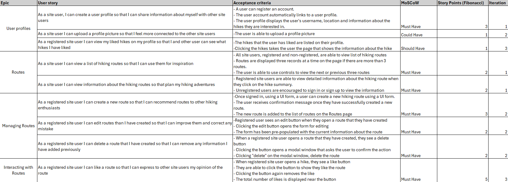

Before development was started the User Stories were transferred to GitHub projects that was used as a Kanban board to track user stories and the progress made.

| After Iteration 1 | After Iteration 2 | After Iteration 3 |
| ---               |  ---              |  ---              |
|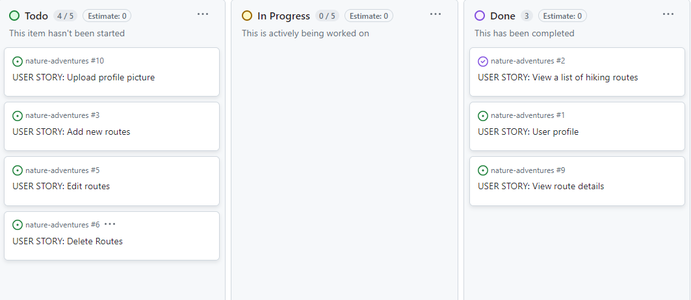|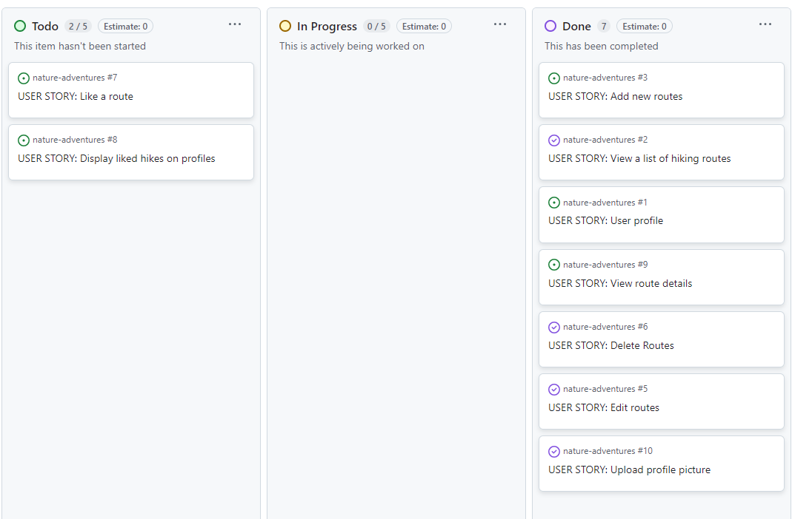|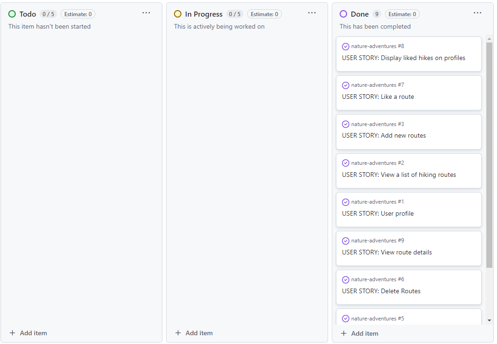|

The Kanban board can be accessed [here](https://github.com/users/jonnlai/projects/3)

### Database Model

The database model was designed using [Lucid](https://lucid.app/). PostgreSQL object-relational database management system was used.

### Structure

The site allows for effortless and intuitive navigation due clear structure and consistent header, footer and navigation bar across all pages. [Lucid](https://lucid.app/) was used to plan the website structure.

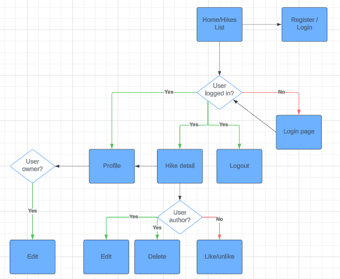

### Wireframes

[Balsamiq](https://balsamiq.com/) User Interface wireframing tool was used to design the structure of the website.

| Feature       | Wireframe |
| ---           | ---       |
| List of hikes | |
| Detail view   | 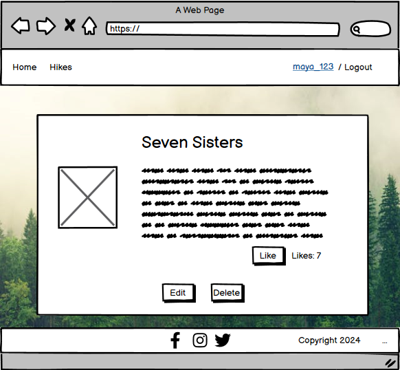|
| Add a Hike    | |
| Edit a Hike   | 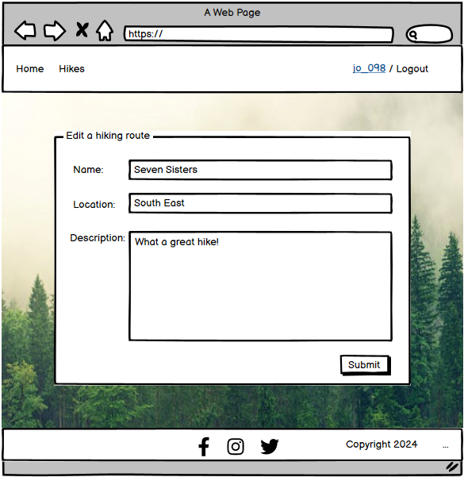|
| Delete a Hike | 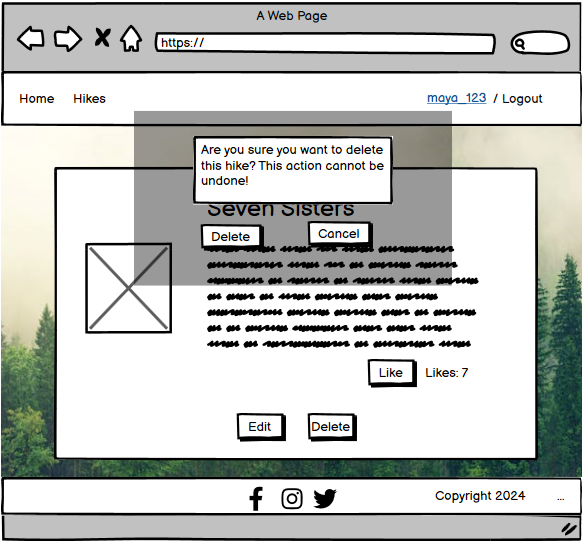|
| View Profile  | 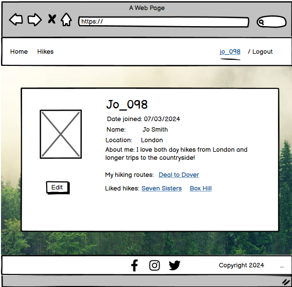|
| Edit Profile  | |

### Colour Scheme

### Typography

The main font used is Raleway with sans serif as the backup font. The font used for heading and the logo is Playpen Sans with cursive as the backup font. 

[Back to top](#nature-adventures)

## Features

### General

* The website was designed following mobile first and responsive design principles.

#### Navigation bar

The navigation bar is consistent across all the pages allowing the user to navigate the site easily. The navigation bar contains Nature Adventure's logo and links to all the sections that the user has access to. When using a smaller device, dropdown hamburger menu is displayed.

| Navbar                    | Image                                                                          |
| ---                       | ---                                                                            |
| User logged in            |          |
| User not logged in        | 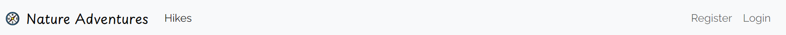 |
| Smaller devices           | 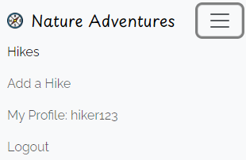                   |

#### Footer

The footer also is the same on all the pages and allows users to easily access Nature Adventure's social media sites.

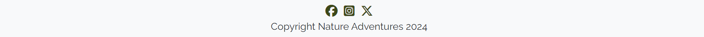

### Hikes

* The Home page displays a paginated list of all the hikes that have been added to the site.
* The hikes are displayed in the order of total likes received. The hike that has received the most likes is displayed first. 
* All the users can see basic information about the hikes including the name, distance, region and the total number of likes the hike has received.

    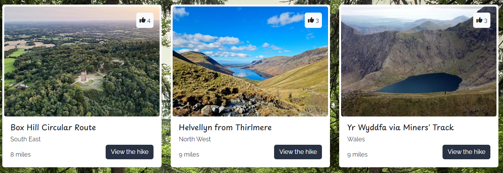

#### Pagination

The pagination controls always displays three page numbers highlighting the page that user is on. The next and previous buttons are disabled as appropriate if the user is on the first or last page.

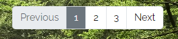

#### Non-registered users

Non-registered users are encouraged to login or sign up to be able to use other functionalities.

### Hike detail

#### Login

If non-registered user attempts to access the hike details, they are advised to login or sign up.

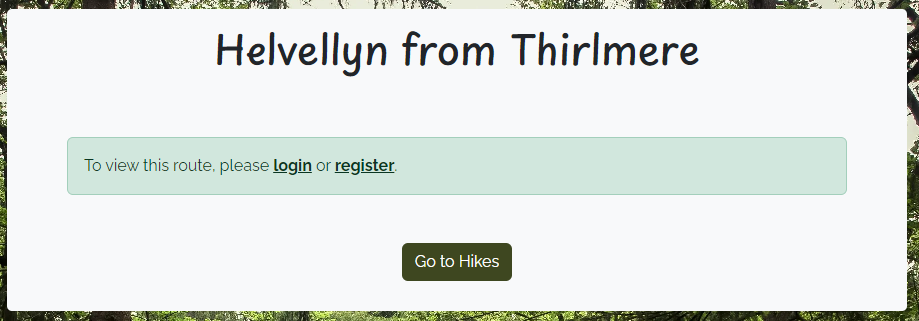

#### Details

Registered users are able to view all the hike details including name, distance, region, author, date created, number of likes and which users have liked the hike.

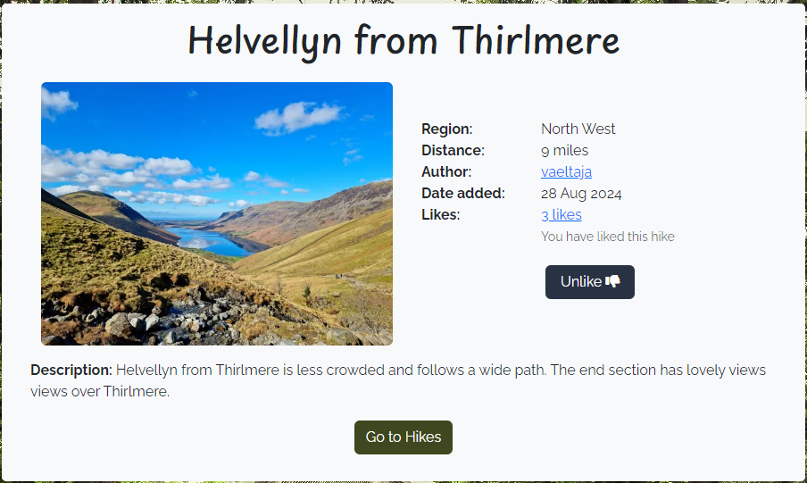

#### Update/delete buttons

The user who created the hike also has "Update" and "Delete" buttons to allow them to manage their hikes.

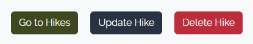

#### Likes

All registered users other than the author of the hike are able to like/unlike the hike. 'You have liked this hike' is displayed above the hike button if the user has already liked the hike. A list of all users who have liked the hike is displayed as a Bootstrap popover.

| Feature       | Image                                                     |
| ---           | ---                                                       |
| Like button   | 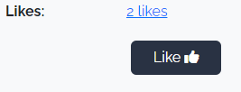     |
| Unlike button | 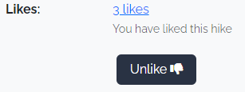 |
| Popover       | 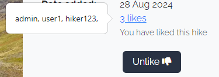    |

### Add/update/delete hikes

* Add a hike form allows registered users to share their knowledge by add new hiking routes.
* Update hike page allows the author of the hike to make edits to the information that they has added. The current information about the hike has been prefilled for the ease of use.
* Delete hike button opens a delete hike modal that confirms that the user really wants to delete the hike. 

    | Add a hike                                              |   Update a hike                                           | Delete a hike                                                |
    | ---                                                     | ---                                                       | ----                                                         |
    | 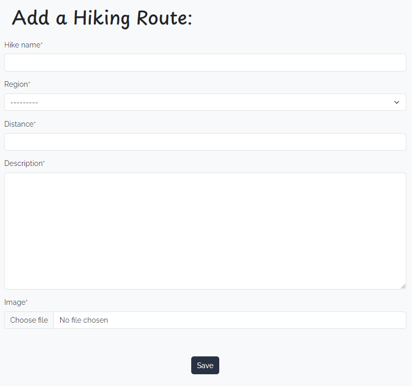| 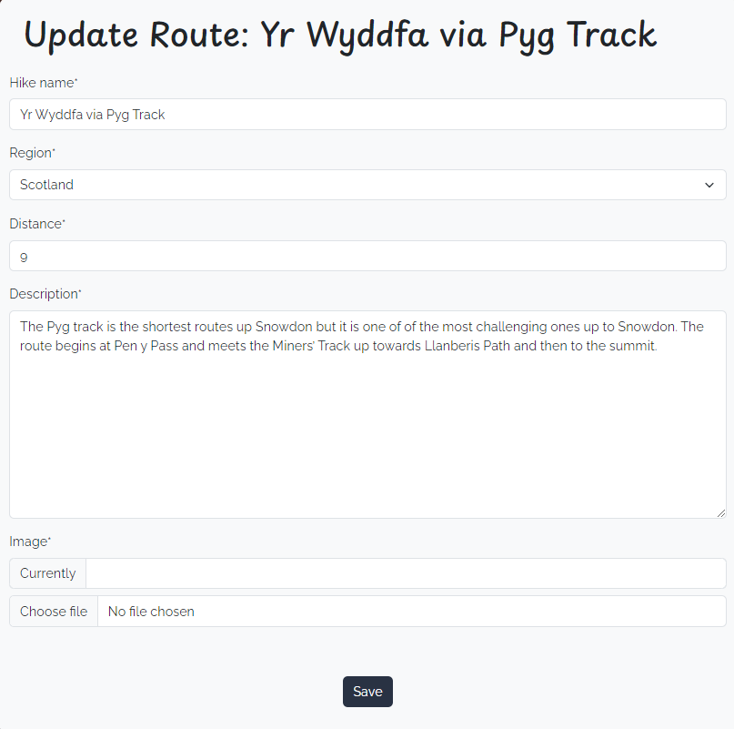|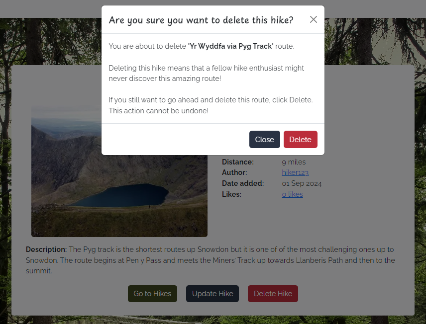|

### Profile page

Registered users can view their own profiles as well as the profiles of other registered users. In addition to username, region and description, the hikes that the user has created and liked are also displayed.

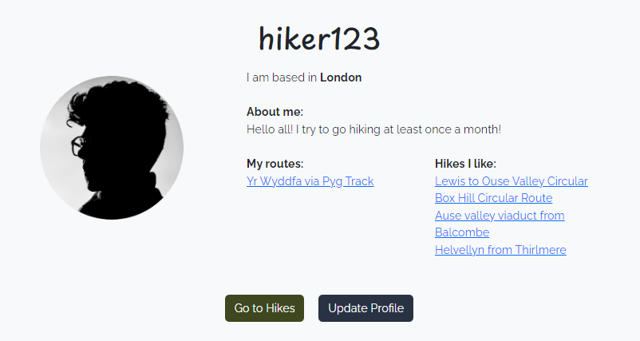

### Update profile

Users can update their own profile to ensure that their information is up-to-date.

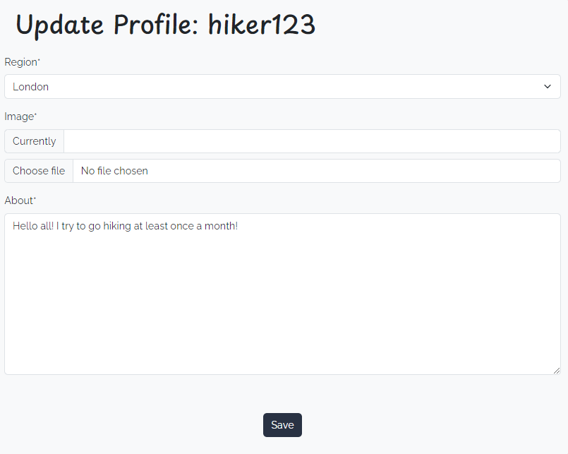

### Authentication pages

* The registeration page allows new users to sign up and create a profile for the site.
* The login page allows registered users to sign in using their login details.
* The logout page allows registered users to sign out.

| Register                                                  | Login                                             | Logout                                             |
| ---                                                       | ---                                               | ---                                                |
| 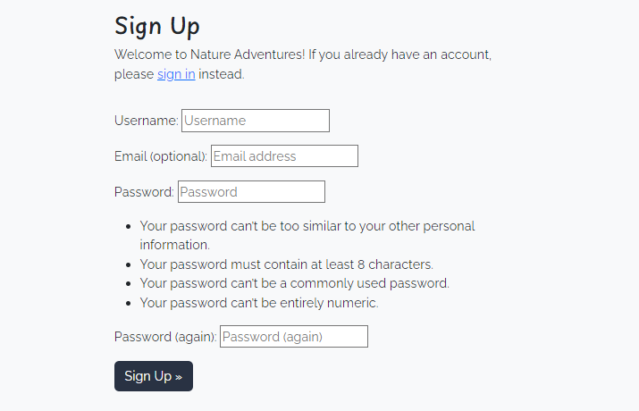    | 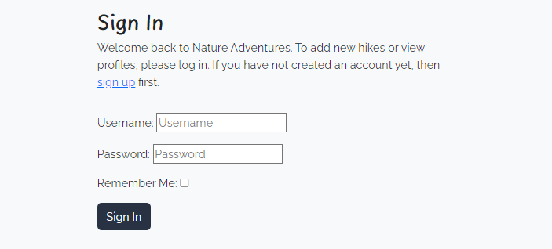  | 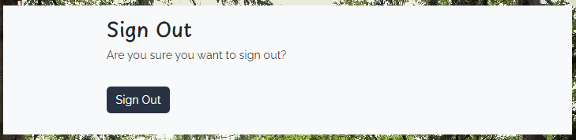 |

## Testing

### Testing user stories

#### User Profiles
1. As a site user, I can create a user profile so that I can share information about myself with other site users
2. As a site user I can upload a profile picture so that I feel more connected to the other site users
3. As a registered site user I can view my liked hikes on my profile so that I and other user can see what hikes I have liked

#### Routes
1. As a site user I can view a list of hiking routes so that I can use them for inspiration
2. As a site user I can view information about the hiking routes so that plan my hiking adventures

#### Managing Routes
1. As a registered site user I can create a new route so that I can recommend routes to other hiking enthusiasts
2. As a registered site user I can edit routes than I have created so that I can improve them and correct any mistake
3. As a registered site user I can delete a route that I have created so that I can remove any information I have added previously

#### Interacting with Routes
1. As a registered site user I can like a route so that I can express to other site users my opinion of the route

### Code validation

* The [W3C Markup Validator](https://validator.w3.org/), [W3C CSS Validator](https://jigsaw.w3.org/css-validator/) and [JSHint](https://jshint.com/) were used to validate the HTML, CSS and JS code to ensure that the project meets the current Web Standards and is free from any unintended syntax errors and mistakes that could cause issues with accessibility and usability.

* W3C Markup Validator:
    * highlighted that when creating a Bootstrap popover to display the people who had liked the hike, a link element had been used instead of a button element. The link element was replaced with a button element. 
    * highlighted that several closing div elements were missing. There were added to fix the errors.
    * highlighted that the form elements had empty "action" attributes. Links to the appropriate URLs were added to fix these errors.
    * highlighted that several trailing slashes. These were ignores as they have added by Cloudinary.

    | Page          | Feedback                                                                      |
    | ---           | ---                                                                           |
    | Hikes list    | 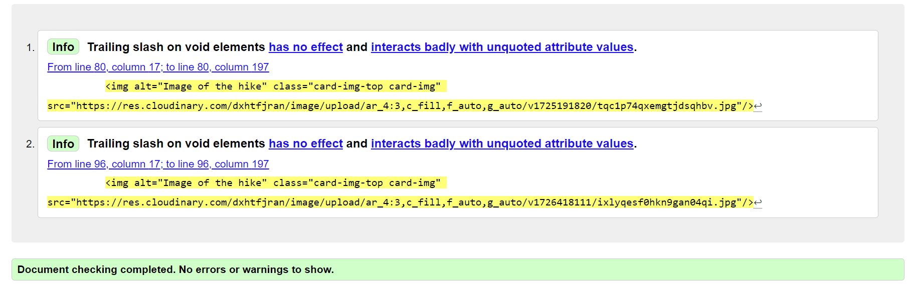       |
    | Hike info     | 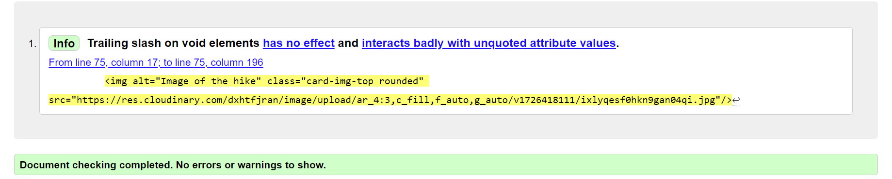       |
    | Create a hike | 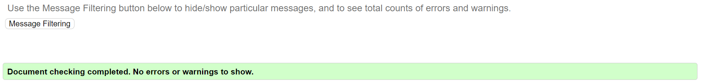   |
    | Edit a hike   | 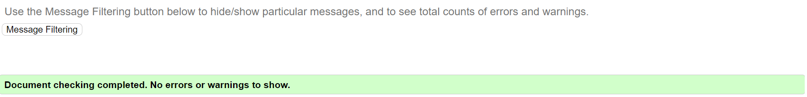       |
    | Profile       | 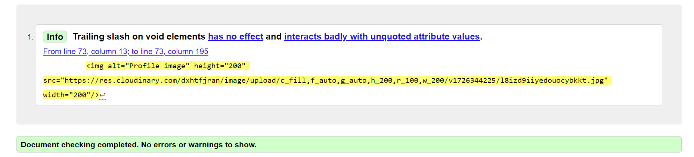             |
    | Edit profile  | 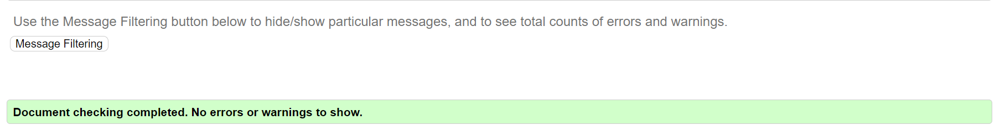 |
    | 404           | 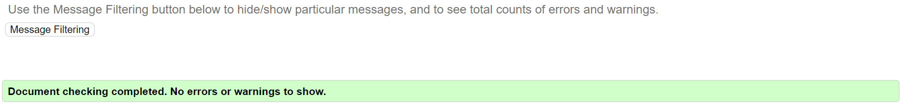                |

* W3C CSS Validator:
    * highlighted that "right" is not a value of the property "align-items". This was fixed by replacing "right" with the value "start".

    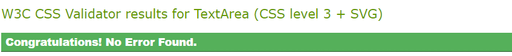

* JSHint:
    * highlighted that some semicolons were missing. These were added.
    * highlighted that "popover" and "bootstrap" are not used. These were ignore as they are part of the Bootstrap popover code.

    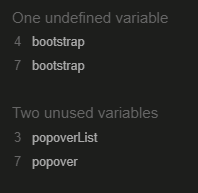

* [autopep8](https://pypi.org/project/autopep8/), [Flake8](https://flake8.pycqa.org/en/latest/) and [CI Python Linter](https://pep8ci.herokuapp.com/#) were used to validate the Python code for PEP8 requirements.

### Performance and Accessibility

Chrome DevTool Lighthouse was used to assess the project's performance and accessibility. The reports confirmed that the page performs well and is accessible. The recommadations relating to Best Practice noted that because of Cloudinary the site is using third party cookies.

| Page tested   | Report                                                                        |
| ---           | ---                                                                           |
| Hikes list    | 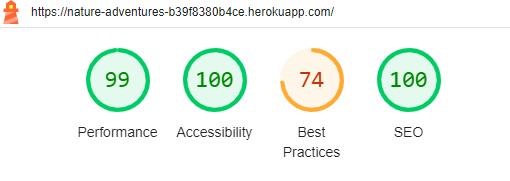        |
| Hike info     | 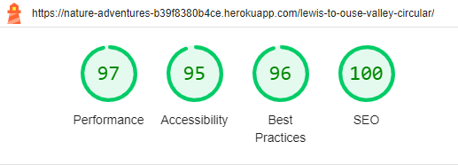       |
| Create a hike | 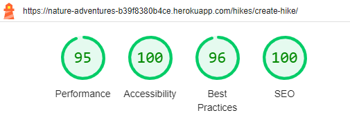   |
| Edit a hike   | 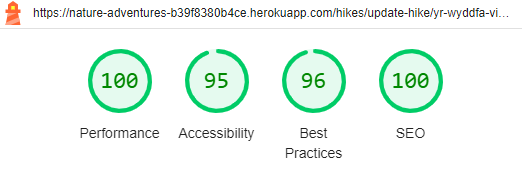     |
| Profile       | 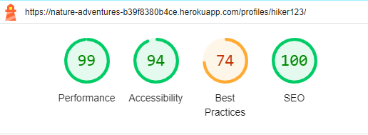             |
| Edit profile  | 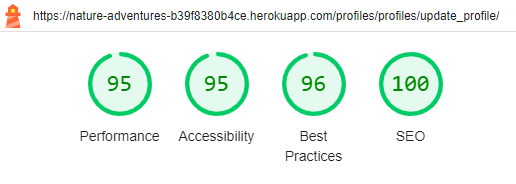 |
| Register      | 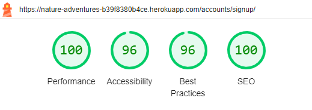           |
| Login         | 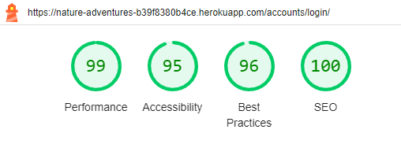                 |
| Logout        | 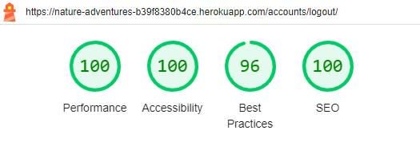               |

### Responsiveness

In addition to manual checks, responsiveness was tested further using Chrome DevTools and Responsive Design Checker.

### Manual testing

#### Browser compatibility

| Browser          | Outcome                                                  | Pass/Fail |
| ---              | ---                                                      |           |
| Google Chrome    | No appearance, responsiveness nor functionality issues.  | Pass      |
| Mozilla Firefox  | No appearance, responsiveness nor functionality issues.  | Pass      |
| Microsoft Edge   | No appearance, responsiveness nor functionality issues.  | Pass      |
| Samsung Internet | No appearance, responsiveness nor functionality issues.  | Pass      |

#### Device compatibility

| Device                 | Outcome                                                 | Pass/Fail |
| ---------------------- | ------------------------------------------------------- | --------- |
| Sony Xperia 10 III     | No appearance, responsiveness nor functionality issues. | Pass      |
| Samsung Galaxy A55     | No appearance, responsiveness nor functionality issues. | Pass      |
| Lenovo Yoga s730       | No appearance, responsiveness nor functionality issues. | Pass      |
| Sony VAIO 15"          | No appearance, responsiveness nor functionality issues. | Pass      |
| Dell P2419H 24" screen | No appearance, responsiveness nor functionality issues. | Pass      |
| Samsung Galaxy Tab S4  | No appearance, responsiveness nor functionality issues. | Pass      |

#### Common Elements Testing

* **Navigation bar**

    | Feature               | Outcome                                                                                                           | Pass/Fail |
    | ---                   | ---                                                                                                               | ---       |
    | Main logo             | Redirects to the main page/hikes list.                                                                            | Pass      |
    | Hikes link            | Redirects to the main page/hikes list. When the page is active, the font colour is slightly darker.               | Pass      |
    | Add a Hike link       | Redirects to the new hike page. Only visible when logged in. When active, the font color is slightly darker.      | Pass      |
    | My Profile link       | Only displayed when logged in. The correct user is shown. Redirects to the user's profiles.                       | Pass      |
    | Logout                | Only displayed when logged in. Redirects to the logout page.                                                      | Pass      |
    | Login                 | Only displayed when not logged in. Redirects to the login page.                                                   | Pass      |
    | Register              | Only displayed when not logged in. Redirects to the registeration page.                                           | Pass      |
    | Hamburger menu        | Navigation menu works as expected on smaller devices.                                                             | Pass      |

* **Footer**

    | Feature               | Outcome                                                                                               | Pass/Fail |
    | ---                   | ---                                                                                                   | ---       |
    | Facebook icon         | Opens Facebook on a separate tab.                                                                     | Pass      |
    | Instagram icon        | Opens Instagram on a separate tab.                                                                    | Pass      |
    | X icon                | Opens X on a separate tab.                                                                            | Pass      |

* **Hikes list**

    | Feature               |   Outcome                                                                                                                         | Pass/Fail |
    | ---                   |  ---                                                                                                                              | ---       |
    | List                  | A list is displayed and ordered based on the number of likes.                                                                     | Pass      |
    | Likes                 | The number of likes are displayed on the top right-hand over. The number updates appropriately.                                   | Pass      |
    | View hike button      | Works as expected. Opens a page about the selected hike. Hover effect works as expected.                                          | Pass      |
    | Pagination            | Works as expected. Three pages are always listed. The current page is indicated. Previous/next button is disabled appropriately.  | Pass      |

* **Hike detail**

    | Feature               |   Outcome                                                                                                                                      | Pass/Fail |
    | ---                   |  ---                                                                                                                                           | ---       |
    | Login                 | If not logged in, request to login or register is displayed                                                                                    | Pass      |
    | Hike details          | Displayed as expected                                                                                                                          | Pass      |
    | Hike image            | Displayed as expected. Aspect ratio 4:3. The placeholder image is displayed if no image has been added by the user.                            | Pass      |
    | Hike author           | Displayed correctly. Clicking the name redirects to their profile.                                                                             | Pass      |
    | Date added            | Displayed correctly                                                                                                                            | Pass      |
    | Likes                 | Number of likes displayed. If there are likes, clicking the link opens a popover that shows who has liked the hike.                            | Pass      |
    | Like button           | The word like and correct icon displayed. Hover effect works. When clicked the button changes to 'unlike'.                                     | Pass      |
    | Unlike button         | The word 'unlike' and correct icon displayed. Hover effect works. When clicked, the button changes to 'like'.                                  | Pass      |
    | Return to Hikes button| Displayed if the previous URL was a page higher than 1 of the paginated list of hikes. Redirects the user back on the page number they were on.| Pass      |
    | Go to Hikes button    | Displayed if the previous URL was any other page than above. Redirects the user back on the first page of the list of hikes.                   | Pass      |
    | Update Hike button    | Displayed only to the author. Redirects to Update Hike page. Hover effect works correctly.                                                     | Pass      |
    | Delete Hike button    | Displayed only to the author. Opens a modal window. Hover effect works correctly.                                                              | Pass      |

* **Update Hike**

    | Feature               |   Outcome                                                                                                     | Pass/Fail |
    | ---                   |  ---                                                                                                          | ---       |
    | Name                  | Updates correctly. Slug is updated to reflect the new name. Two hikes cannot be given the same name.          | Pass      |
    | Region                | Dropdown works correctly. A value must be selected.                                                           | Pass      |
    | Distance              | Works correctly. An integer between 1-200 must be selected.                                                   | Pass      |
    | Description           | Works as expected. Required field.                                                                            | Pass      |
    | Image                 | Uploads correctly. Not a required field.                                                                      | Pass      |

* **Delete Hike**

    | Feature               |   Outcome                                                                                                     | Pass/Fail |
    | ---                   |  ---                                                                                                          | ---       |
    | Modal                 | Confirms the name of the hike being deleted.                                                                  | Pass      |
    | Close button          | Hover works as expected. Closes the modal if clicked.                                                         | Pass      |
    | Delete button         | Hover works as expected. Deletes the hike if clicked. Redirects to hikes list.                                | Pass      |

* **Add a Hike**

    | Feature               |   Outcome                                                                                                     | Pass/Fail |
    | ---                   |  ---                                                                                                          | ---       |
    | Login                 | If trying to access the page without logging in, the user is redirected to the login page.                    | Pass      |
    | Hike name             | Error message is displayed if invalid name is given including names already in use.                           | Pass      |
    | Region                | Required field. Works as expected.                                                                            | Pass      |
    | Distance              | Error message is displayed if distance is not >=1 and <=200                                                   | Pass      |
    | Description           | Works as expected. Required field.                                                                            | Pass      |
    | Image                 | Uploads correct. Not a required field. Uses placeholder image if no image added.                              | Pass      |
    | Save button           | Works as expected. Redirects to the hike page after saving successfully.                                      | Pass      |
    | Error message         | Displayed correctly below the navigation bar.                                                                 | Pass      |

* **Profile**

    | Feature               |   Outcome                                                                                                     | Pass/Fail |
    | ---                   |  ---                                                                                                          | ---       |
    | Automatic creation    | A profile is created automatically when new user signs up. All information is left blank.                     | Pass      |
    | User datails          | Displayed as expected.                                                                                        | Pass      |
    | Profile image         | Default image shown if no image has been uploaded. Image displayed correctly.                                 | Pass      |
    | Hike links            | Links to likes and added hikes displayed below user details. Links work correctly.                            | Pass      |
    | Update profile button | Only displayed to the owner of the profile. Always directs the user to edit their own profile only.           | Pass      |

* **Update Profile**

    | Feature               |   Outcome                                    | Pass/Fail |
    | ---                   |  ---                                         | ---       |
    | Region                | Functions as expected.                       | Pass      |
    | Image                 | Uploads image correctly.                     | Pass      |
    | About                 | Functions as expected.                       | Pass      |
    | Save button           | Functions as expected. Redirects to profile  | Pass      |

* **Authentication**

    | Feature               |   Outcome                                    | Pass/Fail |
    | ---                   |  ---                                         | ---       |
    | Login                 | Works as expected.                           | Pass      |
    | Register              | Works as expected.                           | Pass      |
    | Logout                | Works as expected.                           | Pass      |

### Unit testing

## Technologies Used

### Languages used

* [HTML5](https://en.wikipedia.org/wiki/HTML)
* [CSS3](https://en.wikipedia.org/wiki/CSS)
* [JavaScript](https://en.wikipedia.org/wiki/JavaScript)
* [Python](https://en.wikipedia.org/wiki/Python_(programming_language))

### Libraries and Frameworks used

* [Django](https://www.djangoproject.com/) web framework was used to develop the site.

* [Django Template](https://jinja.palletsprojects.com) was used as a templating language for Django.
   
* [Bootstrap 5](https://getbootstrap.com/docs/5.0/getting-started/introduction/) was used throughout the website to improve responsiveness and styling.

### Packages / Dependecies installed

* [Django Allauth](https://django-allauth.readthedocs.io/en/latest/) was used for user authentication, registration, and account management.

* [Django Crispy Form](https://django-crispy-forms.readthedocs.io/en/latest/) was used to control the rendering of the forms. 
 
* [Gunicorn](https://gunicorn.org/) was used as the Python Web Server Gateway Interface (WSGI) HTTP server. 

* [Cloudinary](https://cloudinary.com/) was used as the image management solution.

* [Whitenoise](https://pypi.org/project/whitenoise/) was used to serve static files.

### Database Management

* [Postgres](https://www.postgresql.org/) object-relational database system was used in production.

### Tools and Programs

* [Git](https://git-scm.com) was used for version control.

* [GitPod](https://gitpod.io/) was used for writing code, committing, and then pushing to GitHub.

* [GitHub](https://github.com) was used to store the code.

* [Heroku](https://www.heroku.com) was used to deploy the website.

* [Tiny PNG](https://tinypng.com) was used to reduce the file size of the images.

* [Pixelied](https://pixelied.com/convert/jpg-converter/jpg-to-webp) was used to convert images to WEBP format.

* [Coolors](https://coolors.co) was used to create a color scheme for the website.

* [Balsamiq](https://balsamiq.com/) was used to create the wireframes.

* [Chrome DevTools](https://developer.chrome.com/docs/devtools/) were used during development process for code review and to test responsiveness.

* [W3C Markup Validator](https://validator.w3.org/) was used to validate the HTML code.

* [W3C CSS Validator](https://jigsaw.w3.org/css-validator/) was used to validate the CSS code.

* [JSHint](https://jshint.com/) was used to validate the site's JavaScript code.

* [autopep8](https://pypi.org/project/autopep8/) was used to automatically validate the site's Python code.

* [flake8](https://flake8.pycqa.org/en/latest/) was used to validate the site's Python code.

* [Favicon.cc](https://www.favicon.cc/) was used to create the site favicon.

* [Google Fonts](https://fonts.google.com) was used to import the fonts used.

* [Font Awesome](https://fontawesome.com) was used to add icons such as social media icons and the "like" icon.

https://learndjango.com/tutorials/django-slug-tutorial

## Credits: 

- default hiking image: Photo by Guduru Ajay bhargav: https://www.pexels.com/photo/people-walking-on-road-near-trees-at-daytime-photo-1076081/
- default hiking image 2: Photo by Eric Sanman: https://www.pexels.com/photo/group-of-person-walking-in-mountain-1365425/
- Seven Sisters: Photo by Andras Stefuca: https://www.pexels.com/photo/seven-sisters-sussex-england-17568779/
- background image: Photo by Markus Spiske: https://www.pexels.com/photo/light-landscape-nature-forest-117843/
- Snowdon: Photo by Julien Goettelmann: https://www.pexels.com/photo/scenic-panorama-of-a-mountain-lake-snowdon-wales-uk-12021273/
- Lake District (Helvellyn): Photo by T6 Adventures: https://www.pexels.com/photo/lake-wast-water-in-wasdale-valley-part-of-lake-district-national-park-18671162/
- surrey: Photo by Ollie Craig: https://www.pexels.com/photo/ancient-gothic-tower-located-on-hill-surrounded-by-green-trees-5344943/
- compass: Photo by Supushpitha Atapattu: https://www.pexels.com/photo/round-grey-and-black-compass-1736222/

- profile pic - hiker123 : Photo by mohamed abdelghaffar: https://www.pexels.com/photo/man-in-black-jacket-771742/
- profile pic - admin: Photo by George Dolgikh: https://www.pexels.com/photo/woman-taking-selfie-while-smiling-1310522/
- profile pic - vaeltaja: Photo by Italo Melo: https://www.pexels.com/photo/portrait-photo-of-smiling-man-with-his-arms-crossed-standing-in-front-of-a-wall-2379004/
- profile pic - user1 : Photo by Christina Morillo: https://www.pexels.com/photo/woman-standing-near-whiteboard-1181519/
- profile pic: Photo by Anna Nekrashevich: https://www.pexels.com/photo/photo-of-man-wearing-eyeglasses-6801642/

-Favicon: <a href="https://www.freepik.com/icon/compass_10507707#fromView=search&page=2&position=33&uuid=8f47f99c-0454-4226-bf39-8848ce14fd41">Icon by Smashicons</a>

<a href="https://www.freepik.com/free-photo/crop-hand-with-compass-nature_2415325.htm#fromView=search&page=1&position=47&uuid=66f2ab65-d34d-4178-990c-bc72d2c66713">Image by freepik</a>

<a href="https://www.freepik.com/free-vector/flat-design-sport-silhouette_65686980.htm#fromView=search&page=1&position=9&uuid=9fad7fc0-9ade-4f98-8fae-b41f0a5853fd">Image by freepik</a>

###Credits:

automatically create profile:
# How to create profile automatically using signals taken from:
# https://www.youtube.com/watch?v=H8MmNqDyra8&list=
# PLCC34OHNcOtoQCR6K4RgBWNi3-7yGgg7b&index=3

how to create a profile:
# Inspiration taken from:
# https://dev.to/earthcomfy/django-user-profile-3hik
# and https://www.youtube.com/watch?v=KNvSWubOaQY

