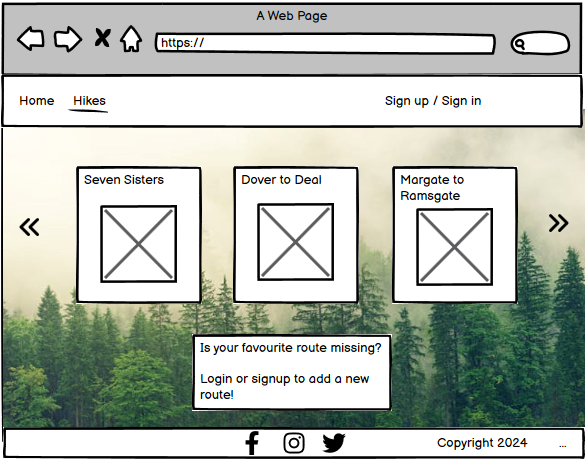

# Nature Adventures

Luonto is a website designed to allow people to share information about their favourite hiking routes with others.

The website aims to encourage people encourage each other to go outdoors by sharing advice and informatio with each other. Registered users of the website vote the routes to indicate to other users which routes they have liked. 

Visit the deployed site [here](https://nature-adventures-b39f8380b4ce.herokuapp.com/)

## Table of Contents

## User Experience (UX)

### Project Goals

* The website creates a sense of adventure and encourages people to get outdoors.
* The website is responsive and can easily be used on different devices.
* The style and structure of the website is consistant to allow user to navigate the website easily
* Users are able to create a profile to encourage the users to get to know each other. 

### User Stories

Excel spreadsheet was used to collect epics and user stories before development was started. Four Epics were identified to help to organise the work: 1. User Profiles, 2. Routes, 3. Managing Routes and 4. Interacting with Routes. These Epics were broekn down into user stories with clearly definied Acceptance Criteria, Story Points and MoSCoW prioritisation. 

Before development was started the User Stories were transferred to GitHub projects that was used as a Kanban board to track user stories and the progress made.

| After Iteration 1 | After Iteration 2 | After Iteration 3 |
| ---               |  ---              |  ---              |
||||

### Database Model

### Wireframes

[Balsamiq](https://balsamiq.com/) User Interface wireframing tool was used to design the structure of the website.

| Feature       | Wireframe |
| ---           | ---       |
| List of hikes | |
| Detail view   | |
| Add a Hike    | |
| Edit a Hike   | |
| Delete a Hike | |
| View Profile  | |
| Edit Profile  | |

### Colour Scheme

### Typography

The main font used is Raleway with sans serif as the backup font. The font used for heading and the logo is Playpen Sans with cursive as the backup font. 

[Back to top](#nature-adventures)

## Features

### General

* The website was designed following mobile first and responsive design principles.
* The navigation bar allows the user to navigate the site easily.

https://learndjango.com/tutorials/django-slug-tutorial

###Credits: 

- default hiking image: Photo by Guduru Ajay bhargav: https://www.pexels.com/photo/people-walking-on-road-near-trees-at-daytime-photo-1076081/
- default hiking image 2: Photo by Eric Sanman: https://www.pexels.com/photo/group-of-person-walking-in-mountain-1365425/
- Seven Sisters: Photo by Andras Stefuca: https://www.pexels.com/photo/seven-sisters-sussex-england-17568779/
- background image: Photo by Markus Spiske: https://www.pexels.com/photo/light-landscape-nature-forest-117843/
- Snowdon: Photo by Julien Goettelmann: https://www.pexels.com/photo/scenic-panorama-of-a-mountain-lake-snowdon-wales-uk-12021273/
- Lake District (Helvellyn): Photo by T6 Adventures: https://www.pexels.com/photo/lake-wast-water-in-wasdale-valley-part-of-lake-district-national-park-18671162/
- surrey: Photo by Ollie Craig: https://www.pexels.com/photo/ancient-gothic-tower-located-on-hill-surrounded-by-green-trees-5344943/
- compass: Photo by Supushpitha Atapattu: https://www.pexels.com/photo/round-grey-and-black-compass-1736222/

- profile pic - hiker123 : Photo by mohamed abdelghaffar: https://www.pexels.com/photo/man-in-black-jacket-771742/
- profile pic - admin: Photo by George Dolgikh: https://www.pexels.com/photo/woman-taking-selfie-while-smiling-1310522/
- profile pic - vaeltaja: Photo by Italo Melo: https://www.pexels.com/photo/portrait-photo-of-smiling-man-with-his-arms-crossed-standing-in-front-of-a-wall-2379004/
- profile pic - user1 : Photo by Christina Morillo: https://www.pexels.com/photo/woman-standing-near-whiteboard-1181519/
- profile pic: Photo by Anna Nekrashevich: https://www.pexels.com/photo/photo-of-man-wearing-eyeglasses-6801642/

-Favicon: <a href="https://www.freepik.com/icon/compass_10507707#fromView=search&page=2&position=33&uuid=8f47f99c-0454-4226-bf39-8848ce14fd41">Icon by Smashicons</a>

<a href="https://www.freepik.com/free-photo/crop-hand-with-compass-nature_2415325.htm#fromView=search&page=1&position=47&uuid=66f2ab65-d34d-4178-990c-bc72d2c66713">Image by freepik</a>

###Credits:

automatically create profile:
# How to create profile automatically using signals taken from:
# https://www.youtube.com/watch?v=H8MmNqDyra8&list=
# PLCC34OHNcOtoQCR6K4RgBWNi3-7yGgg7b&index=3

how to create a profile:
# Inspiration taken from:
# https://dev.to/earthcomfy/django-user-profile-3hik
# and https://www.youtube.com/watch?v=KNvSWubOaQY

